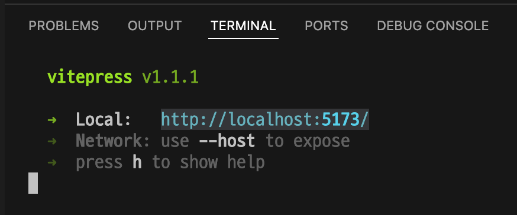
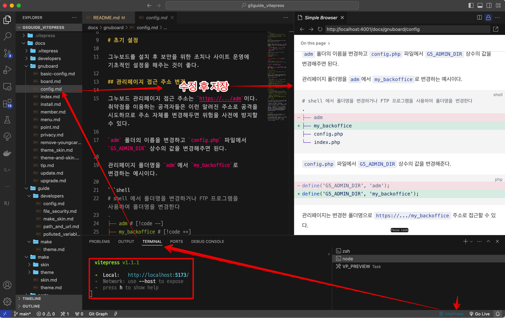

# 그누보드5 가이드

이 저장소는 그누보드5의 가이드를 문서를 작성하기 위한 저장소입니다.

Markdown 포맷으로 작성한 문서는 [VitePress](https://vitepress.dev)를 통해 아래와 같이 완성된 사이트 형태로 만들어 집니다.
Markdown 문법은 https://vitepress.dev/guide/markdown 페이지에서 확인할 수 있습니다.

그누보드5 가이드: https://g5guide.github.io

그누보드, 영카트의 사용자 매뉴얼과 개발자를 위한 가이드를 포함할 예정이지만 문서화 작업 참여에 따라 전체 문서가 완성되지 않을 수 있습니다.

## 참여 방법

이 저장소를 fork하여 콘텐츠를 수정하고 PR을 보내주세요.
오탈자를 고쳐주셔도되며 관심있는 부분의 문서를 작성하거나 목차나 문서의 구성에 대한 제안을 주셔도 좋습니다.

### fork repo 관리
다음 명령어로 레포지토리를 로컬 컴퓨터에 클론합니다.

$`git clone {자신의 fork버전 repo}`

### 모듈 설치
VitePress는 Node.js 패키지이며 로컬 개발서버를 실행해서 빌드된 사이트를 확인할 수 있습니다. 자신의 로컬컴퓨터에 전역적으로 Node.js가 설치 되어있어야 `npm`명령어를 사용할 수 있습니다.

 아래 `npm`명령어를 사용해  필요한 모듈을 설치해주세요. 본 레포지토리에는 이미 VitePress가 사전정의 되어있으므로 VitePress를 별도로 추가할 필요 없습니다.

~~~
cd /path/to/{클론받은 레포지토리}
npm ci
~~~

### 로컬 사이트 보기

 `package.json`에 사전정의된 script 명령어를 터미널에 입력해서 로컬 개발서버를 실행할 수 있습니다.

$`npm run docs:dev`

터미널에 아래와 같은 안내가 출력되면 웹브라우저에서 `Local` 주소로 접속해볼 수 있습니다.

* 실행취소: `ctr`+`c`

### 가이드 문서 수정
`docs` 폴더 하위의 디렉토리는 URL 경로이며 `.md` 파일은 `.html` 페이지로 변환됩니다. `.md` 파일을 수정, 추가하여 가이드를 문서를 작성하면 됩니다.

### Visual Studio Code 추천 확장
VitePress는 확장된 마크다운 문법을 사용하므로 일부 문법은 자신의 에디터에서의 Preview와 다를 수 있습니다. 

또한 `.md`파일을 수정/저장할때마다 실행한 로컬사이트의 페이지를 찾아보기 번거로울 수 있습니다.

아래의 확장을 설치하고 이 확장으로 로컬서버를 실행하면 `.md`를 선택할 때마다 VS Code에서 VitePress로 빌드된 웹페이지를 바로 볼 수 있습니다.

[VitePress Preview](https://marketplace.visualstudio.com/items?itemName=fantasy.vp-preview)

확장을 설치하고나면 VS Code 오른쪽 하단에 `VitePress`버튼을 클릭하거나 아래 커맨드를 실행해 로컬서버를 시작해주세요. 안된다면 확장을 재로드 한 뒤 시도해주세요.
* VS Code command(ctr+shift+p): `VitePress: Start Preview Server`

이제 수정하려는 `.md` 파일을 선택 할 때마다 해당 페이지가 빌드된 Preview창이 나타날 것입니다. 

### 기여
문서를 수정하고 커밋이 완료되었다면 자신의 fork 버전 origin으로 push 한 뒤, github에서 Pull Request를 생성해주세요.

## 저작권 및 라이선스 안내

작성되는 문서는 [저작자표시-동일조건변경허락 4.0 국제 (CC BY-SA 4.0)](https://creativecommons.org/licenses/by-sa/4.0/deed.ko) License가 적용됩니다.

